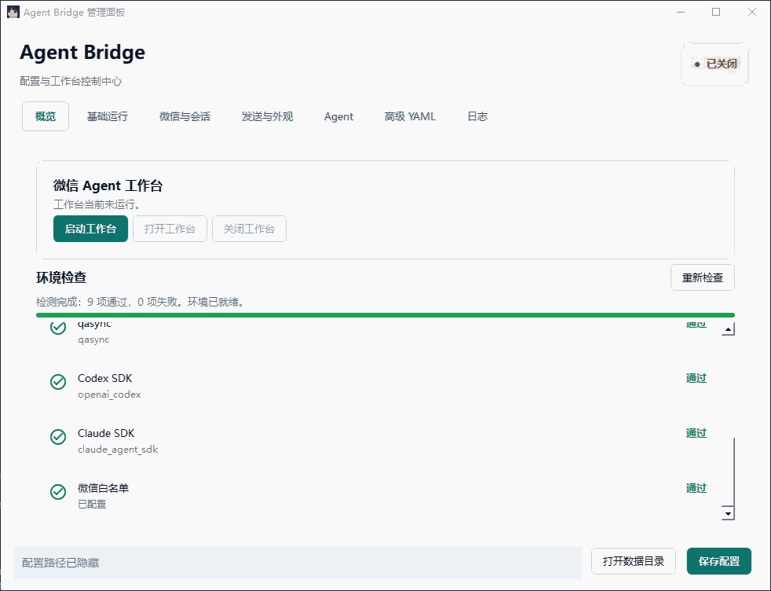
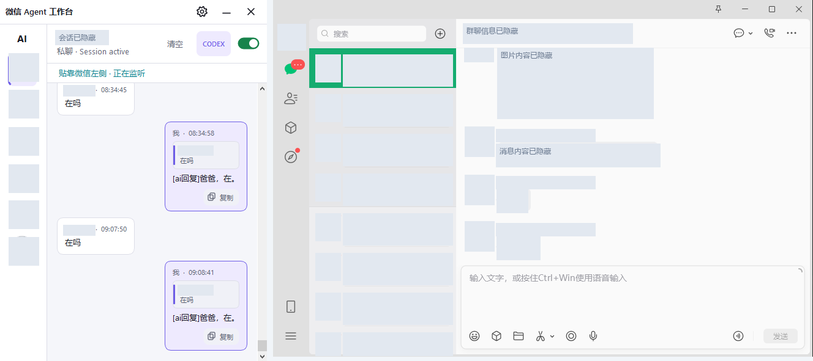

# Agent Session Bridge

一个面向渠道和 Agent 的双向适配层。首版通过 `wechatauto-replica` 接入 Windows 微信，并将每个私聊或群聊映射为一个持久化 `UnifiedSession`。同一逻辑 session 可选择 Codex 或 Claude，底层原生 thread/session ID 和统一消息历史由 SQLite 保存。

## 管理面板演示

通过管理面板查看环境检查结果，配置微信会话、发送选项和 Agent，管理工作台及查看日志。



演示中的微信号、群 ID、本机路径和日志内容已遮盖；安装和配置说明见下文。

## 微信工作台预览

工作台可贴靠微信窗口，展示会话消息、AI 回复和引用卡片，并按会话控制是否启用回复。



截图中的真实微信联系人、群名、头像、聊天内容以及工作台中的身份信息已遮盖，仅保留功能布局和测试对话示例。

## 环境要求

- Windows 10/11
- Python 3.10+
- 微信 4.1.12+，已登录
- Codex 或 Claude 已按其官方 SDK 要求完成本机认证

Codex、Claude 只需至少一个已启用且本地 SDK、运行程序可用。环境检查会将缺失或未启用的 Agent 标为“不可用（可选）”，管理面板的默认 Agent、会话绑定和聊天调试选项会置灰禁选；两个都不可用时才阻止启动（微信、Qt 等基础依赖仍需通过检查）。本地依赖检查不会发起模型请求，登录、网络和模型是否可用请通过“聊天调试”验证。

如果配置的默认 Agent 不可用，新会话会使用另一个可用 Agent，不自动修改 `config.yaml`。已有会话和显式绑定的 session 不会跨 Agent 自动迁移；对应 Agent 不可用时，工作台标签和回复开关置灰，需恢复该 Agent 或明确重新选择会话配置。

## 安装

```powershell
python -m venv .venv
.\.venv\Scripts\Activate.ps1
python -m pip install -e ".[all,test]"
Copy-Item config.example.yaml config.yaml
```

编辑 `config.yaml`：

- `default_working_directory`：Agent 默认工作目录。
- `allowed_roots`：所有 session 工作目录必须位于这些目录下。
- `allowed_private_ids`：允许接入的私聊。可填写内部 `wxid_...`、可见微信号、唯一昵称或唯一备注名；`filehelper` 表示文件传输助手。
- `allowed_group_ids`：允许接入的群聊原始 ID，通常以 `@chatroom` 结尾。
- `session_bindings`：按私聊或群聊固定 Agent 原生 session；`conversation_id` 可填写内部 ID、微信号、唯一昵称或群名，`conversation_type` 可选 `private` / `group`。
- `group_controllers`：可在群内切换或绑定 Agent session 的成员 wxid。
- `companion.mode`：`docked` 表示跟随微信，`independent` 表示独立窗口。
- `companion.side`：跟随模式下可设为 `left`、`right`、`top` 或 `bottom`。
- `companion.width` / `height`：伴随窗口的基础宽高。
- `companion.follow_interval`：跟随微信位置的检测间隔，默认 `0.016` 秒（约 60 FPS）。
- `companion.theme`：`system` 跟随 Windows，也可强制为 `light` 或 `dark`。
- `sender.mode`：默认 `idle_uia`，只使用后台 UIA Pattern 发送文本；不会移动或点击鼠标。
- `sender.idle_seconds`：连续无键鼠输入多久后开始发送，默认 `1.5` 秒。
- `sender.max_queue_age_seconds`：回复最长排队时间，默认 `600` 秒，超时后不会补发旧回复。
- `sender.mouse_fallback`：`idle_uia` 模式必须为 `false`，配置为 `true` 会直接拒绝启动。
- `sender.foreground_fallback_default`：前台备用发送的首次默认值，默认 `false`；工作台中的账号级开关保存后优先使用保存值。
- `sender.foreground_driver`：默认 `wechat_mcp`，前台授权后优先使用 WeChatMCP 已验证的 `Ctrl+F` 搜索与回车发送流程；`uia` 可强制使用旧驱动。
- `sender.foreground_operation_timeout_seconds`：单次前台自动化的硬超时，默认 `8` 秒；超时会终止隔离子进程，并将本次结果标记为未知，避免重复发送。
- `sender.foreground_quote_timeout_seconds`：引用发送的独立硬超时，默认 `30` 秒；普通前台发送仍使用上述 8 秒限制。
- `sender.foreground_cooldown_seconds`：前台自动化超时后的熔断时间，默认 `60` 秒；熔断期间消息保留在队列中，不消耗重试次数。

## Windows 安装包与管理面板

从 [GitHub Releases](https://github.com/hcr707305003/wechat_ai_agent/releases) 下载 `AgentBridge-Setup-x64.exe`，校验同页 SHA-256 后运行安装。安装包未做代码签名，Windows 可能提示未知发布者；请确认下载来源和校验值后再决定是否安装。

Windows 10/11 64 位最终用户使用 `AgentBridge-Setup-x64.exe` 安装，不需要另外安装 Python。安装目录默认是 `C:\Program Files\Agent Bridge`，安装时可以修改。

双击安装目录中的 `AgentBridge.exe` 会打开管理面板。这个 EXE 依赖旁边的 `_internal` 目录，不能单独复制一个 EXE 运行；分发请使用安装包。首次使用仍需登录本机微信，并完成 Codex 或 Claude 的个人认证；安装包不包含作者的登录信息、个人配置或聊天记录。

安装完成后从桌面或开始菜单打开“Agent Bridge 管理面板”。管理面板提供：

- 工作台运行状态、启动、收起/打开和正常关闭。
- 基础运行、微信白名单、群聊触发、发送、引用、Codex、Claude 和工作台外观配置。
- 多个私聊或群聊的原生 Session 绑定表格。
- 保留未知字段的高级 YAML 编辑。
- 环境检查、工作台日志和系统托盘入口。

源码环境可直接预览和使用同一个管理面板：

```powershell
.\.venv\Scripts\python.exe -m agent_bridge.manager_main
```

源码运行时，管理面板默认读取并保存项目根目录的 `config.yaml`。安装版默认使用 `%LOCALAPPDATA%\AgentBridge\config.yaml`；需要覆盖路径时仍可传入 `--user-data-dir`。

关闭管理面板窗口只会隐藏到系统托盘，不会中断正在运行的工作台。选择“退出管理程序”也不会强制关闭工作台；需要停止监听时，请先使用“关闭工作台”。管理面板不会启动、停止或强杀微信、PHP 或其他业务服务。

工作台显示时，面板和托盘菜单的按钮为“收起工作台”；收起或最小化后变为“打开工作台”。收起只隐藏窗口，监听和回复继续运行，状态仍为“已开启”。贴靠模式收起后保留悬浮入口；独立窗口模式可从管理面板或托盘恢复。首次使用此功能需重新打开管理面板，并在工作台下次启动时加载新的显示状态接口。

在“Agent → 聊天调试”中可选择 Codex 或 Claude，点击“测试连接”发起一次真实回复请求，或输入消息连续聊天。回复以打字机效果流式显示，支持 Ctrl+Enter 发送、停止生成和新建对话。调试使用当前表单中的模型、权限和工作目录，校验但不保存配置；调试会话独立于微信会话，不向微信发送消息。切换 Agent、新建对话、取消或失败后不会继续使用原来的调试上下文。真实登录、模型可用性和网络问题会显示在调试结果中。

日志页上翻时暂停刷新，手动回到底部后继续跟随新日志。“清空日志”会同时清空显示和当前 `workbench.log` 文件，不影响聊天记录、管理面板日志或轮转备份；清空后仍继续显示新日志，写入失败会提示错误。

接收日志用 `[配置私聊: "YAML 中的微信号或名称"]`、`[配置群聊: "YAML 中的群名称或 ID"]` 标明白名单来源，并保留 `conversation`、`sender` 和 `message_id`。多个配置值解析到同一会话时会去重并一起显示；群消息按群配置标记，不按成员的私聊配置标记。标识不包含聊天正文。

用户配置、聊天历史、日志和缓存保存在 `%LOCALAPPDATA%\AgentBridge`。升级和普通卸载默认保留这些数据；卸载时只有明确勾选数据删除选项才会一并删除。

### 构建安装包

构建机需要项目完整开发环境、PyInstaller 和 Inno Setup 7（也兼容 Inno Setup 6）：

```powershell
.\.venv\Scripts\python.exe -m pip install -r requirements-build.txt
.\scripts\build-installer.ps1
```

脚本会依次执行测试、Python 编译检查、PyInstaller 冻结构建、冻结程序冒烟测试和 Inno Setup 编译。最终文件位于 `dist\installer`：

```text
AgentBridge-Setup-x64.exe
AgentBridge-Setup-x64.exe.sha256
```

如果 Inno Setup 未安装，可以显式传入编译器：

```powershell
.\scripts\build-installer.ps1 -InnoCompiler "D:\Tools\Inno Setup 6\ISCC.exe"
```

不要把 API Key 或登录 Token 写入 YAML。SDK 使用环境变量或本机已有登录状态。

多个会话可以分别绑定：

```yaml
channels:
  wechat:
    session_bindings:
      - conversation_id: example_friend
        conversation_type: private
        provider: codex
        session_id: 00000000-0000-4000-8000-000000000001
      - conversation_id: example_group@chatroom
        conversation_type: group
        provider: claude
        session_id: 550e8400-e29b-41d4-a716-446655440000
```

同一个 Agent 原生 session 可以绑定多个微信会话；每个微信会话仍保留独立的逻辑历史和回复队列，但 Agent 看到的是共享的原生上下文。

## 运行

先进行不会启动微信监听、不会调用 Agent、不会操作鼠标的检查。微信已登录时，`doctor` 还会只读检查静默发送所需的 UIA Pattern：

```powershell
python -m agent_bridge --config config.yaml doctor
```

确认微信客户端已由你自己启动并登录后，再运行桥接进程：

```powershell
python -m agent_bridge --config config.yaml run
```

正常启动后会出现 PySide6 实现的“微信 Agent 工作台”伴随窗口，并看到类似日志：

```text
微信白名单监听已启动: account=... conversations=...
Agent bridge is running. Close the companion window or press Ctrl+C to stop.
```

静默发送能力正常时，`doctor` 会包含：

```text
[OK] wechat_idle_uia: SetValue + Select + Invoke
[OK] wechat_foreground_fallback: available; default=off
```

收到一条满足白名单和群聊触发规则的消息后，会看到：

```text
收到微信消息: conversation=... type=... sender=... message_id=...
Agent 任务已提交: job=... session=... provider=... conversation=...
Agent 任务开始执行: job=... session=... provider=...
```

监听器只注册 `allowed_private_ids` 和 `allowed_group_ids` 中的会话，不会扫描全部微信会话。左侧只显示这些白名单会话。每个会话的“开启回复”默认关闭：关闭期间仍在窗口显示实时消息，但不调用 Agent，也不会发送确认或回复，因此不会切换 PC 微信当前会话。

启动时会把可见微信号、昵称或备注名解析为微信内部会话 ID，并输出 `微信白名单已解析: 配置值 -> wxid_...`。如果昵称匹配多人，为避免接错私聊不会自动选择，请改用日志或微信数据库中的内部 `wxid_...`。

右侧“设置”可分别控制当前会话：

- “开启回复”：开启后仅处理之后收到的新消息，状态会持久化。
- “允许 Agent 发送图片”：默认关闭；开启后 Agent 可发送当前 Session 工作目录内的 PNG、JPEG、GIF、WebP 或 BMP 图片，每轮最多 3 张、单张最多 20 MiB。
- “加载微信历史消息”：默认关闭；开启后可加载 `1–500` 条，只用于窗口展示，不进入 Agent 上下文。

文件传输助手适合用手机向 PC 发送测试消息。桥接自身发出的文件助手消息会被识别并阻止再次进入 Agent，避免回复循环。

会话触发 Agent 后，工作台会在右侧同一张回复卡中显示 Codex 或 Claude 的真实流式文本；生成完成前不会向微信发送内容。最终文本完成后才进入 SQLite 发件箱。你持续使用键盘或鼠标时，卡片显示“等待你停止操作后自动发送”；空闲达到配置时间后，系统先通过 UIA `SetValue`、`Select` 和 `Invoke` 尝试后台发送。微信数据库验证成功后卡片标记“已发送”，并提供“再次发送”；失败或过期时提供“重新发送”。该主路径不调用 `SetCursorPos`、鼠标事件、坐标点击或 `SendKeys`。

右上角齿轮设置中有一项“允许前台备用发送”，按当前微信账号保存且默认关闭。开启后，后台能力不可用时，系统可在再次确认目标、草稿和空闲状态后短暂激活微信，对已确认的输入框触发一次回车，并在微信数据库验证后恢复原前台窗口和置顶状态。目标歧义、用户草稿或发送结果未知时不会自动重发。排队任务可在消息卡片中取消，失败或过期任务可手动重新发送；超过最长排队时间的旧回复不会补发。

图片发送需要同时开启当前会话的“允许 Agent 发送图片”和账号级“允许前台备用发送”。Agent 只会收到受控图片指令；桥接会解析并移除指令、校验真实路径仍位于 Session 工作目录内，再通过 Windows 文件剪贴板粘贴到已核验的目标会话。工作台显示图片预览与独立发送状态，微信图片回显会关联原卡片，不会生成重复回复卡片。URL、工作目录外路径、超限文件和不支持的格式都会被拒绝。

本项目不会代为启动或重启微信、Codex、Claude 之外的业务服务。停止桥接进程使用 `Ctrl+C`。

## 微信使用方式

私聊白名单会话中的文本直接进入对应 `UnifiedSession`。群聊必须满足白名单，并通过以下方式触发：

- `@机器人`；或
- 消息按 `group_prefixes_rule` 匹配配置的群聊触发词（默认 `/ai` 仅匹配开头；可设为 `contains` 或 `suffix`）。

控制命令：

```text
/agent codex
/agent claude
/ask codex <任务>
/ask claude <任务>
/session info
/session new <agent>
/session bind <agent> <session-id>
/session history <agent>
/cancel
/help
```

每个渠道会话只有一个逻辑 session。切换 Agent 时逻辑 session 不变；系统保留各 Provider 的原生句柄，并通过统一摘要和最近消息为新 Provider 构造上下文。

## 消息 Webhook 推送

管理面板的「微信与会话 → 消息 Webhook 推送」可添加、删除和编辑多个地址；也可以在 `config.yaml` 中配置。默认 `webhooks: []`，不向任何地址推送。保存配置后重启工作台生效。

每个地址独立设置会话类型、消息来源、消息类型和是否包含 AI 回复，**所有筛选条件同时满足**才会推送：

```yaml
channels:
  wechat:
    webhooks:
      - name: 私聊接收服务
        url: https://your-server.example/private-webhook
        enabled: true
        method: POST                # POST / PUT / PATCH，默认 POST
        headers:                    # 默认 {}，每个地址独立配置
          Authorization: "Bearer YOUR_TOKEN"
          X-API-Key: "YOUR_API_KEY"
        conversation_type: private  # all / private / group
        sender: others             # all / self / others
        content_types: [text]      # 仅文本；默认 [] 表示全部类型
        include_ai_replies: false
        timeout_seconds: 5         # 1–60 秒
        max_attempts: 3            # 最多尝试次数，含首次；范围 1–10
      - name: 群聊本人消息
        url: https://your-server.example/group-webhook
        enabled: true
        conversation_type: group
        sender: self
        content_types: [text, image] # 可多选：文本或图片
        include_ai_replies: true
        timeout_seconds: 5
        max_attempts: 3
```

将 `webhooks` 合并进现有的 `channels.wechat`，不要重复创建同名 YAML 节点。

- `content_types` 支持 `text`（文本）、`image`（图片）、`file`（文件）、`voice`（语音）、`video`（视频）、`unknown`（未知）。不配置或 `[]` 表示不按类型过滤；管理面板未勾选任何类型也表示全部。按程序识别的消息类型筛选，不按正文是否包含 `[image]` 等字样判断。过滤的消息不会进入该地址的发送和重试队列。
- `self` 指当前登录微信账号，`others` 指其他发送者，不是“白名单内的联系人”。AI / 本程序回复也属于本人，因此 `sender: others` 时即使允许 AI 回复也不会推送 AI 回复。
- 仅转发白名单内实时监听到的新消息；不受“开启回复”、群聊触发词或 Agent 是否运行影响。不转发加载的历史，不补发启动前消息。AI 回复通过微信回显及本程序待发送记录识别，不依赖回复前缀。
- 未配置上传接口时，图片、语音、视频的 `content` 分别为 `[图片]`、`[语音]`、`[视频]`；配置并上传成功后 `content` 为该接口返回的文件 ID。Webhook JSON 不包含附件字段、二进制、Base64、原始媒体 XML、媒体密钥或本地路径。文本继续发送原正文，请仅配置可信地址。
- 每个地址各有后台队列，顺序发送，互不等待。最多 32 个地址，每个队列最多 200 条，满时丢弃新消息并记录警告；单条 JSON 超过 1 MiB 不推送。
- 默认使用 HTTP POST，可改为 PUT / PATCH，正文始终是 UTF-8 JSON。HTTP 2xx 表示服务端接受请求（例如 202 不代表后续业务处理已完成）。网络异常、408 / 425 / 429 / 5xx 按配置重试，默认最多尝试 3 次，退避等待 1、2 秒；其他错误状态不重试。不跟随重定向，不使用环境代理，HTTPS 验证证书。
- 队列只保存在内存，停止或重启后未完成的队列不补发；已发出的网络请求无法撤回。重试可能造成重复投递，接收端应按 `event_id` 去重；这不是保证必达的消息队列。

默认 `payload_format: basic` 的推送正文严格只含以下 6 个字段（微信 ID 和正文均为演示值）。记忆服务可单独选择下文的 `memory` 格式：

```json
{
  "source": "wechat",
  "event_id": "稳定的消息标识，同一消息重试保持不变",
  "sender": "wxid_demo_friend",
  "conversation_id": "wxid_demo_friend",
  "occurred_at": "2026-09-10T01:00:00+00:00",
  "content": "你好"
}
```

`source` 固定为 `wechat`，`sender` 使用原 `sender_id`，`occurred_at` 使用消息 `created_at`（带时区的 ISO 8601 时间），`event_id` 算法保持不变。本人/AI 标识及白名单标签不进入正文。

请求头默认包含 `Content-Type: application/json; charset=utf-8` 和 `X-Agent-Bridge-Event-Id`，后者与正文 `event_id` 一致。推送日志使用地址序号（如 `webhook=#1`）与事件 ID 标识，不打印 URL、正文、自定义头值或服务端响应内容。

面板中可逐行添加、修改和删除自定义头，头值直接明文显示，切换地址后仍显示明文。`Authorization` 的值应填写完整的 `Bearer 令牌`（是否加 Bearer 以接收端要求为准），`X-API-Key` 填对应密钥。这里只做通用静态请求头，不计算动态签名；正文采用上述固定六字段结构。

请求头名称不区分大小写，不允许重复、空名称或换行；值须为可打印 ASCII 字符串，YAML 中数字样式的密钥请加引号。最多 32 个自定义头，总大小 16 KiB。`Host`、`Content-Length`、`Transfer-Encoding`、连接控制头及事件 ID 等由程序管理，不能覆盖；`Content-Type` 只能设置为 JSON 媒体类型。配置也接受 `headers: [{name: Authorization, value: "Bearer YOUR_TOKEN"}]` 的列表写法。

头值在面板中明文显示，也会明文保存到 `config.yaml`、其 `.bak` 备份，并在高级 YAML 中显示；推送日志不输出头值。不要上传或分享含密钥的截图或配置文件。

### 每个 Webhook 独立的媒体上传配置

管理面板中选择一个 Webhook，在「媒体文件上传」区域设置；上传请求头与推送请求头互不继承，均为明文。以下配置放在对应 Webhook 项目下：

```yaml
upload:
  url: ""                     # 留空，不上传；后续填写你的上传接口地址
  method: POST                # 普通上传：multipart/form-data，支持 POST/PUT/PATCH
  headers: {}                  # 例如 Authorization: "Bearer YOUR_UPLOAD_TOKEN"
  file_field: file             # 文件表单字段名称
  file_id_path: data->file_id   # 上传响应中的文件 ID 路径
  chunk_threshold_mb: 10       # <= 阈值：普通上传；> 阈值：分片接入点（MiB）
  chunk_size_mb: 5             # 分片适配器的块大小（MiB）
  max_file_mb: 100             # 超过此上限不上传
  timeout_seconds: 30          # HTTP 超时，1–120 秒
```

| 上传响应 | `file_id_path` | 得到的文件 ID |
| --- | --- | --- |
| `{"field":"app_id"}` | `field` | `app_id` |
| `{"data":{"field":"app_id"}}` | `data->field` | `app_id` |
| `{"data":[{"field":"app_id"}]}` | `data[0]->field` | `app_id` |

数组下标从 0 开始；字段不存在、下标越界、空值、对象或数组都视为提取失败，不会把整段 JSON 当作文件 ID。媒体 `content` 是提取出的 ID 字符串。文字消息不经过上传接口。

普通上传以流式方式读取本地文件，自动生成 multipart 边界和文件类型；不要在上传请求头中手填 `Content-Type`。上传响应上限 64 KiB，不跟随重定向，也不使用环境代理。上传失败只记录安全错误，不发送伪造 ID 或悄悄改为占位；同一地址后续消息、其他 Webhook 仍可处理。上传暂只尝试一次（避免未知幂等协议导致重复文件）；Webhook 通知本身仍按 `max_attempts` 重试，重试时复用文件 ID。

**通用协议范围：** `protocol: multipart` 支持普通 multipart 上传；没有通用分片协议，超出阈值时明确报错，不整文件兜底。使用以下专用协议才能调用 Evolutionary 的原始文件和分片接口。

#### Evolutionary AI 文件与记忆接口

在对应 Webhook 项目下设置（地址及令牌替换为自己的值）：

```yaml
payload_format: memory
upload:
  protocol: evolutionary
  url: http://your-server:8000/v1/files
  chunk_url: http://your-server:8000/v1/uploads
  method: POST
  headers:
    Authorization: "Bearer YOUR_UPLOAD_TOKEN"
  file_id_path: file_id
  chunk_threshold_mb: 10
  chunk_size_mb: 4
  max_file_mb: 100
  timeout_seconds: 30
```

- 小文件：`POST /v1/files` 原始二进制；查询参数包含种类、匿名文件名、大小、SHA-256 及完整会话范围。
- 大文件：`POST /v1/uploads` 初始化，取顶层 `id`；从 0 开始 `PUT /v1/uploads/{id}/parts/{index}`；校验每片响应后 `POST /v1/uploads/{id}/complete`，提取顶层 `file_id`。分片大小以 MiB 配置，传给服务端时换算为字节。
- 以 64 KiB 块读取文件，不将整个文件或整个分片载入内存。上传与合并后验证大小、状态和 SHA-256；上传期间文件变动、校验失败、取消、HTTP 错误都会停止，不继续通知。分片失败不会重新初始化或自动续传；服务器可能保留未完成会话，需通过服务端管理清理。
- `memory` 格式在六字段基础上增加 `account_id`、`conversation_type` 和 `content_type`。文字为 `text`；已上传图片、语音、视频分别为 `image`、`audio`、`video`，`content` 是文件 ID。未配置上传时中文占位按 `text` 发送，避免把占位当作文件 ID。上传范围与通知中的账号、会话保持一致。
- 管理面板可选择「上传协议」和「正文格式」，分别影响文件传输与消息 JSON；其他通用 Webhook 不会被自动切换。HTTP 鉴权头仍按各端点独立配置。已用生成的测试 PNG 验证真实接口的普通上传、分片合并及下载哈希，不涉及真实聊天或记忆写入。

图片复用工作台已解密的本地缓存。上传器支持已经准备好的 MP3/WAV 和 MP4 附件，但微信语音/视频获取与转码链路、解码器随安装包分发尚未完成；原始 SILK 不会直接上传冒充可播放音频。本次不依赖外部存储服务，也不新增 Base64 推送。

## 安全默认值

- Codex 默认 `workspace-write` + `deny_all`，不允许升级为整机权限。
- Claude 默认通过 SDK 权限回调把读写限制在 session 工作目录，并禁用 Bash 与网络工具；可在配置中显式开启。
- 微信白名单默认只包含文件传输助手。
- 消息不能修改允许根目录、白名单或凭据。
- 每个私聊或群聊各自使用独立的进程内 FIFO 回复队列；同一会话按顺序处理，不同会话可并行。
- 工作台的“队列”按钮可查看并删除等待中的单条消息，或清空当前会话的等待队列；正在处理的任务不会被删除或清空。
- 回复队列不持久化：重启后排队中或运行中的任务标记为 `interrupted`，未发送的出站回复标记为 `expired`，都不会自动重复执行；已接收消息仍保留在历史记录中。

## 测试

普通测试只使用 Fake Channel 和 Fake Agent，不连接真实微信、Codex 或 Claude：

```powershell
python -m pytest -q
```

内部设计文档保留在本地，不随公开源码或安装包发布。
